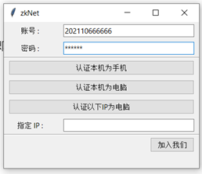
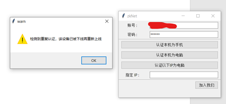
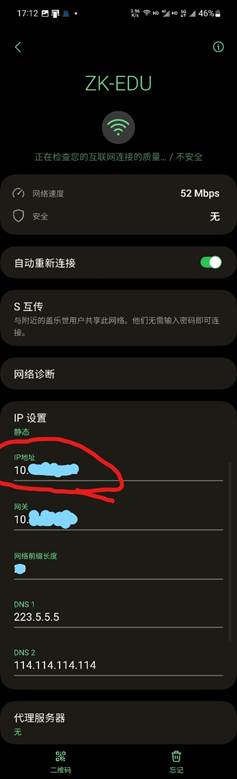
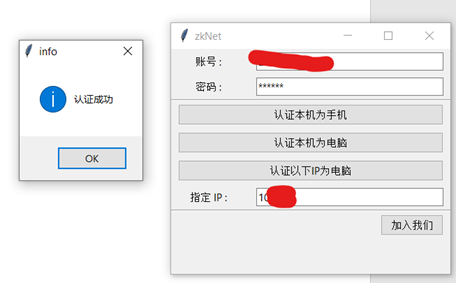

# zkNet

仲恺农业工程学院校园网认证工具

仅适用于海珠校区

## 软件功能

校园网限制只能使用一台手机和一台电脑设备

本工具可以将电脑认证为手机或将手机认证为电脑，使两台电脑同时上网（或两台手机）。

除此之外还提供认证任意ip的功能

--------

## 使用方法

运行刚刚下载好的工具，如果系统提示软件不安全，同意即可（软件是开源的，安全，如果不信任可以自行查阅代码自行打包）

输入账号密码

#### 同时认证两台电脑

两台电脑的其中一台正常登录联网。另一台电脑打开以上工具输入账号密码，然后点击认证本机为手机，提示认证成功即可。

如果提示重复认证（如下），也是成功，只是说明手机之前在登陆，现在电脑把手机给挤掉了

#### 同时认证两台手机/平板

其中一台直接正常登录联网。另一台手机打开wifi设置，查看IP地址

然后在电脑（电脑也需要连上校园网但不用登录）打开以上工具输入账号密码，并在下面的IP输入框内填写以上IP地址。然后点击认证以下IP为电脑，提示认证成功即可。

--------

## 开发原因

一个校园网账号可以同时认证一台手机和一台电脑（共两台设备）上网，但有的设备会被错误认证（例如PS等游戏机），导致设备冲突无法正常联网。合理的需求无法满足，所以本软件用于修复该错误，解决合法需求。本软件可以将错误认证的设备重新认证为其它设备。如将被错误认证为电脑的设备认证为手机，或将被错误认证为手机的设备认证为电脑。

## 声明

本软件开源且免费发布并无任何盈利行为，只是为了学习和研究软件内含的设计思想和原理，促进同学间互相学习交流技术。请勿用于商业用途。

本软件并非破解软件，不提供破解功能，无无任何入侵和破解行为。

本软件不会收集个人信息，账号信息。

### 寻找合作伙伴

我目前专注于将技术转化为实际收益，若有对计算机领域拥有兴趣与相关技能（如电子、网络、软件等），并且怀揣创新思路的同学，我诚挚地邀请您一同研究交流学习做大做强。如果我的微信号无法联系，请您查阅GitHub发布主页以获取最新信息。任何问题或建议，也都欢迎在GitHub上提出issues，期待与您的交流与合作。

微信：

--------
Github页面：https://github.com/LingMessy/zkNet

# License

注意：本软件使用GPL发布，
